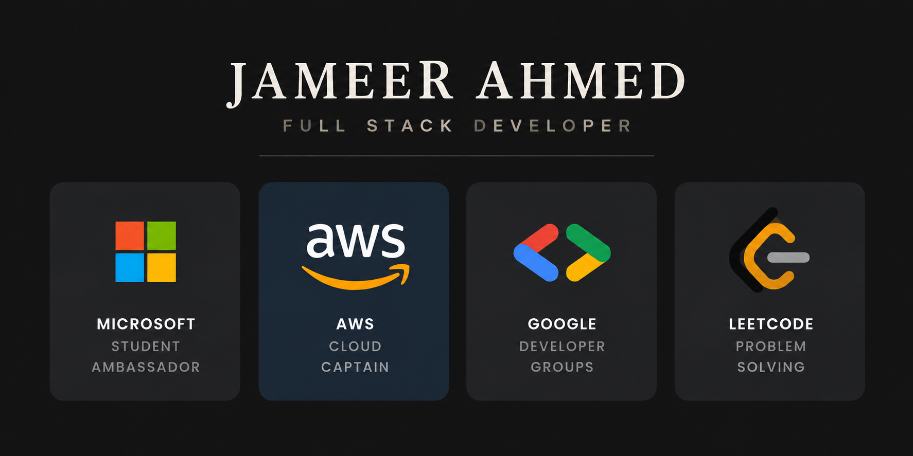
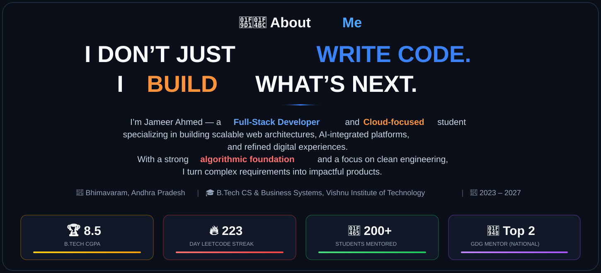
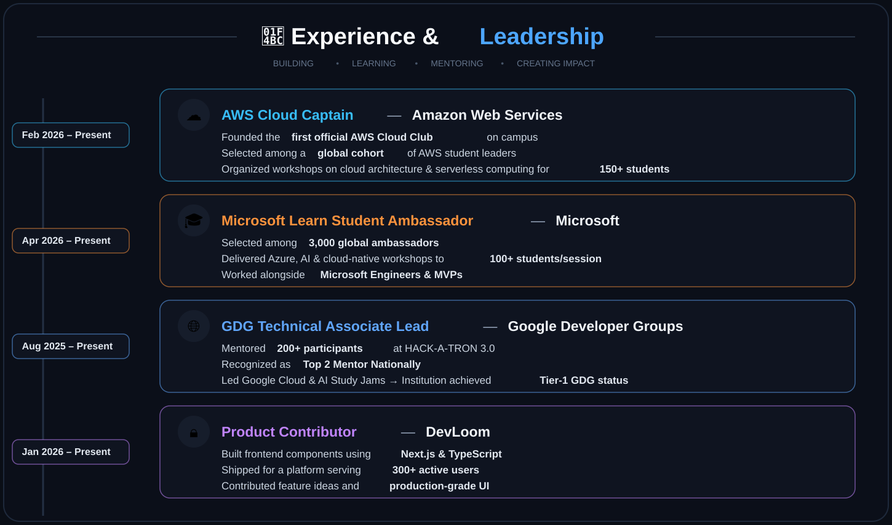
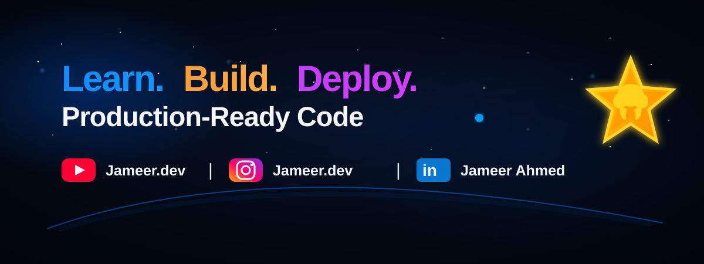

 

 

### *"I'm Jameer Ahmed, a final-year Computer Science and Business Systems student.*
### *I'm someone who loves building — whether that's software or communities."*

 
 

 

---

## 🧑‍💻 About Me

 <svg width="1450" height="660" viewBox="0 0 1450 660" xmlns="http://www.w3.org/2000/svg" xmlns:c2pa="http://c2pa.org/manifest"><metadata><c2pa:manifest>AAAWgmp1bWIAAAAeanVtZGMycGEAEQAQgAAAqgA4m3EDYzJwYQAAABZcanVtYgAAAEdqdW1kYzJtYQARABCAAACqADibcQN1cm46YzJwYTpjNTdjNDFlOS1hMGRmLTQxYjItYTRlOS1hMjMxZjA2YzE0MzcAAAADl2p1bWIAAAApanVtZGMyYXMAEQAQgAAAqgA4m3EDYzJwYS5hc3NlcnRpb25zAAAAALxqdW1iAAAARGp1bWRjYm9yABEAEIAAAKoAOJtxE2MycGEuaW5ncmVkaWVudC52MwAAAAAYYzJzaJSPteHFG0Uvg0ZMFmRggykAAABwY2JvcqNpZGM6Zm9ybWF0bWltYWdlL3N2Zyt4bWxqaW5zdGFuY2VJRHgseG1wOmlpZDo2ZDlkYTgxYi1jZGJkLTQ2MTUtOTg2MS02MjhiODlhMTEzMmZscmVsYXRpb25zaGlwaHBhcmVudE9mAAAB4mp1bWIAAABBanVtZGNib3IAEQAQgAAAqgA4m3ETYzJwYS5hY3Rpb25zLnYyAAAAABhjMnNoZ6hGvjsl6iB5Hma5E2jeXgAAAZljYm9yomdhY3Rpb25zgqJmYWN0aW9ua2MycGEub3BlbmVkanBhcmFtZXRlcnOha2luZ3JlZGllbnRzgaJjdXJseC1zZWxmI2p1bWJmPWMycGEuYXNzZXJ0aW9ucy9jMnBhLmluZ3JlZGllbnQudjNkaGFzaFggelYB/ZiQQ/+he0l4UWZKtpTHbkONG5v78ub7a25TFSukZmFjdGlvbngdY29tLmFudGhyb3BpYy5jbGF1ZGUucHJvdmlkZWRqcGFyYW1ldGVyc6F4H2NvbS5hbnRocm9waWMub3JpZ2luLWNvbmZpZGVuY2VndW5rbm93bmtkZXNjcmlwdGlvbnhmQ2xhdWRlIHByb3ZpZGVkIHRoaXMgZmlsZSBhdCB0aGUgcmVxdWVzdCBvZiBhIHVzZXIgYW5kIG1heSBoYXZlIGNyZWF0ZWQgb3IgbW9kaWZpZWQgdGhlIGZpbGUgY29udGVudHMubXNvZnR3YXJlQWdlbnShZG5hbWVmQ2xhdWRlcmFsbEFjdGlvbnNJbmNsdWRlZPUAAADIanVtYgAAAEBqdW1kY2JvcgARABCAAACqADibcRNjMnBhLmhhc2guZGF0YQAAAAAYYzJzaPGy3NG3KWLvRgl3bqWxU8kAAACAY2JvcqVjYWxnZnNoYTI1NmNwYWRNAAAAAAAAAAAAAAAAAGRoYXNoWCBMakJDf1xP9Dl4sNnddjSB61rx5xzMvRGJcHQGsNQahmRuYW1lbmp1bWJmIG1hbmlmZXN0amV4Y2x1c2lvbnOBomVzdGFydBiYZmxlbmd0aBkeBAAAAj5qdW1iAAAAJ2p1bWRjMmNsABEAEIAAAKoAOJtxA2MycGEuY2xhaW0udjIAAAACD2Nib3KlY2FsZ2ZzaGEyNTZpc2lnbmF0dXJleE1zZWxmI2p1bWJmPS9jMnBhL3VybjpjMnBhOmM1N2M0MWU5LWEwZGYtNDFiMi1hNGU5LWEyMzFmMDZjMTQzNy9jMnBhLnNpZ25hdHVyZWppbnN0YW5jZUlEeCx4bXA6aWlkOjI3MjhmNDRiLTM3NjYtNDNhOC04YTkyLTFiMDAwMDZiNzBmY3JjcmVhdGVkX2Fzc2VydGlvbnODomN1cmx4LXNlbGYjanVtYmY9YzJwYS5hc3NlcnRpb25zL2MycGEuaW5ncmVkaWVudC52M2RoYXNoWCB6VgH9mJBD/6F7SXhRZkq2lMduQ40bm/vy5vtrblMVK6JjdXJseCpzZWxmI2p1bWJmPWMycGEuYXNzZXJ0aW9ucy9jMnBhLmFjdGlvbnMudjJkaGFzaFggD8ikmMp5rsqcvvh/rESJ9pDjyrNAv7taw50XWh5pFluiY3VybHgpc2VsZiNqdW1iZj1jMnBhLmFzc2VydGlvbnMvYzJwYS5oYXNoLmRhdGFkaGFzaFggygZQ8M9P6im364G5AA+7cTS+4lwcj8qCOL5xs4fnpqR0Y2xhaW1fZ2VuZXJhdG9yX2luZm+jZG5hbWVvQW50aHJvcGljIEZpbGVzZ3ZlcnNpb25lMS4wLjBrc3BlY1ZlcnNpb25lMi40LjAAABA4anVtYgAAAChqdW1kYzJjcwARABCAAACqADibcQNjMnBhLnNpZ25hdHVyZQAAABAIY2JvctKEWQISogEmGCFZAgowggIGMIIBjaADAgECAhRA5aAK7sI50L64g/oGQgU9Z1UTADAKBggqhkjOPQQDAzBJMRcwFQYDVQQKEw5BbnRocm9waWMsIFBCQzEuMCwGA1UEAxMlQW50aHJvcGljIENvbnRlbnQgQ3JlZGVudGlhbHMgUm9vdCBDQTAeFw0yNjA4MDcxODQzNTZaFw0yODA4MDYxOTQzNTZaMEQxFzAVBgNVBAoTDkFudGhyb3BpYywgUEJDMSkwJwYDVQQDEyBBbnRocm9waWMgQ2xhdWRlIENvbnRlbnQgU2lnbmluZzBZMBMGByqGSM49AgEGCCqGSM49AwEHA0IABJh6CmvLUBgFFNU0vUKlOVtE6djd17L5SuwX0LemFisBM3dkd/3cyjxFA3Qo5S46fX0/ihY0VZ7mfb9KF703t5OjWDBWMA4GA1UdDwEB/wQEAwIHgDAVBgNVHSUEDjAMBgorBgEEAYPoXgIBMAwGA1UdEwEB/wQCMAAwHwYDVR0jBBgwFoAUzlHiBIFOZFsj+OPEz5o+nMHXXMIwCgYIKoZIzj0EAwMDZwAwZAIwMXMdFJ4BetLLVY7ORuE9noqbbAZOZn/aArXyTwFAZfKrPzxF2vPoJNf1+UCdg1XGAjBwX1zd9WGqYkqmL5SFqw1QySjr1zJfpJM9+1rdDwSPLMOPOjKuiXjoU/pUUeG9RwmhY3BhZFkNngAAAAAAAAAAAAAAAAAAAAAAAAAAAAAAAAAAAAAAAAAAAAAAAAAAAAAAAAAAAAAAAAAAAAAAAAAAAAAAAAAAAAAAAAAAAAAAAAAAAAAAAAAAAAAAAAAAAAAAAAAAAAAAAAAAAAAAAAAAAAAAAAAAAAAAAAAAAAAAAAAAAAAAAAAAAAAAAAAAAAAAAAAAAAAAAAAAAAAAAAAAAAAAAAAAAAAAAAAAAAAAAAAAAAAAAAAAAAAAAAAAAAAAAAAAAAAAAAAAAAAAAAAAAAAAAAAAAAAAAAAAAAAAAAAAAAAAAAAAAAAAAAAAAAAAAAAAAAAAAAAAAAAAAAAAAAAAAAAAAAAAAAAAAAAAAAAAAAAAAAAAAAAAAAAAAAAAAAAAAAAAAAAAAAAAAAAAAAAAAAAAAAAAAAAAAAAAAAAAAAAAAAAAAAAAAAAAAAAAAAAAAAAAAAAAAAAAAAAAAAAAAAAAAAAAAAAAAAAAAAAAAAAAAAAAAAAAAAAAAAAAAAAAAAAAAAAAAAAAAAAAAAAAAAAAAAAAAAAAAAAAAAAAAAAAAAAAAAAAAAAAAAAAAAAAAAAAAAAAAAAAAAAAAAAAAAAAAAAAAAAAAAAAAAAAAAAAAAAAAAAAAAAAAAAAAAAAAAAAAAAAAAAAAAAAAAAAAAAAAAAAAAAAAAAAAAAAAAAAAAAAAAAAAAAAAAAAAAAAAAAAAAAAAAAAAAAAAAAAAAAAAAAAAAAAAAAAAAAAAAAAAAAAAAAAAAAAAAAAAAAAAAAAAAAAAAAAAAAAAAAAAAAAAAAAAAAAAAAAAAAAAAAAAAAAAAAAAAAAAAAAAAAAAAAAAAAAAAAAAAAAAAAAAAAAAAAAAAAAAAAAAAAAAAAAAAAAAAAAAAAAAAAAAAAAAAAAAAAAAAAAAAAAAAAAAAAAAAAAAAAAAAAAAAAAAAAAAAAAAAAAAAAAAAAAAAAAAAAAAAAAAAAAAAAAAAAAAAAAAAAAAAAAAAAAAAAAAAAAAAAAAAAAAAAAAAAAAAAAAAAAAAAAAAAAAAAAAAAAAAAAAAAAAAAAAAAAAAAAAAAAAAAAAAAAAAAAAAAAAAAAAAAAAAAAAAAAAAAAAAAAAAAAAAAAAAAAAAAAAAAAAAAAAAAAAAAAAAAAAAAAAAAAAAAAAAAAAAAAAAAAAAAAAAAAAAAAAAAAAAAAAAAAAAAAAAAAAAAAAAAAAAAAAAAAAAAAAAAAAAAAAAAAAAAAAAAAAAAAAAAAAAAAAAAAAAAAAAAAAAAAAAAAAAAAAAAAAAAAAAAAAAAAAAAAAAAAAAAAAAAAAAAAAAAAAAAAAAAAAAAAAAAAAAAAAAAAAAAAAAAAAAAAAAAAAAAAAAAAAAAAAAAAAAAAAAAAAAAAAAAAAAAAAAAAAAAAAAAAAAAAAAAAAAAAAAAAAAAAAAAAAAAAAAAAAAAAAAAAAAAAAAAAAAAAAAAAAAAAAAAAAAAAAAAAAAAAAAAAAAAAAAAAAAAAAAAAAAAAAAAAAAAAAAAAAAAAAAAAAAAAAAAAAAAAAAAAAAAAAAAAAAAAAAAAAAAAAAAAAAAAAAAAAAAAAAAAAAAAAAAAAAAAAAAAAAAAAAAAAAAAAAAAAAAAAAAAAAAAAAAAAAAAAAAAAAAAAAAAAAAAAAAAAAAAAAAAAAAAAAAAAAAAAAAAAAAAAAAAAAAAAAAAAAAAAAAAAAAAAAAAAAAAAAAAAAAAAAAAAAAAAAAAAAAAAAAAAAAAAAAAAAAAAAAAAAAAAAAAAAAAAAAAAAAAAAAAAAAAAAAAAAAAAAAAAAAAAAAAAAAAAAAAAAAAAAAAAAAAAAAAAAAAAAAAAAAAAAAAAAAAAAAAAAAAAAAAAAAAAAAAAAAAAAAAAAAAAAAAAAAAAAAAAAAAAAAAAAAAAAAAAAAAAAAAAAAAAAAAAAAAAAAAAAAAAAAAAAAAAAAAAAAAAAAAAAAAAAAAAAAAAAAAAAAAAAAAAAAAAAAAAAAAAAAAAAAAAAAAAAAAAAAAAAAAAAAAAAAAAAAAAAAAAAAAAAAAAAAAAAAAAAAAAAAAAAAAAAAAAAAAAAAAAAAAAAAAAAAAAAAAAAAAAAAAAAAAAAAAAAAAAAAAAAAAAAAAAAAAAAAAAAAAAAAAAAAAAAAAAAAAAAAAAAAAAAAAAAAAAAAAAAAAAAAAAAAAAAAAAAAAAAAAAAAAAAAAAAAAAAAAAAAAAAAAAAAAAAAAAAAAAAAAAAAAAAAAAAAAAAAAAAAAAAAAAAAAAAAAAAAAAAAAAAAAAAAAAAAAAAAAAAAAAAAAAAAAAAAAAAAAAAAAAAAAAAAAAAAAAAAAAAAAAAAAAAAAAAAAAAAAAAAAAAAAAAAAAAAAAAAAAAAAAAAAAAAAAAAAAAAAAAAAAAAAAAAAAAAAAAAAAAAAAAAAAAAAAAAAAAAAAAAAAAAAAAAAAAAAAAAAAAAAAAAAAAAAAAAAAAAAAAAAAAAAAAAAAAAAAAAAAAAAAAAAAAAAAAAAAAAAAAAAAAAAAAAAAAAAAAAAAAAAAAAAAAAAAAAAAAAAAAAAAAAAAAAAAAAAAAAAAAAAAAAAAAAAAAAAAAAAAAAAAAAAAAAAAAAAAAAAAAAAAAAAAAAAAAAAAAAAAAAAAAAAAAAAAAAAAAAAAAAAAAAAAAAAAAAAAAAAAAAAAAAAAAAAAAAAAAAAAAAAAAAAAAAAAAAAAAAAAAAAAAAAAAAAAAAAAAAAAAAAAAAAAAAAAAAAAAAAAAAAAAAAAAAAAAAAAAAAAAAAAAAAAAAAAAAAAAAAAAAAAAAAAAAAAAAAAAAAAAAAAAAAAAAAAAAAAAAAAAAAAAAAAAAAAAAAAAAAAAAAAAAAAAAAAAAAAAAAAAAAAAAAAAAAAAAAAAAAAAAAAAAAAAAAAAAAAAAAAAAAAAAAAAAAAAAAAAAAAAAAAAAAAAAAAAAAAAAAAAAAAAAAAAAAAAAAAAAAAAAAAAAAAAAAAAAAAAAAAAAAAAAAAAAAAAAAAAAAAAAAAAAAAAAAAAAAAAAAAAAAAAAAAAAAAAAAAAAAAAAAAAAAAAAAAAAAAAAAAAAAAAAAAAAAAAAAAAAAAAAAAAAAAAAAAAAAAAAAAAAAAAAAAAAAAAAAAAAAAAAAAAAAAAAAAAAAAAAAAAAAAAAAAAAAAAAAAAAAAAAAAAAAAAAAAAAAAAAAAAAAAAAAAAAAAAAAAAAAAAAAAAAAAAAAAAAAAAAAAAAAAAAAAAAAAAAAAAAAAAAAAAAAAAAAAAAAAAAAAAAAAAAAAAAAAAAAAAAAAAAAAAAAAAAAAAAAAAAAAAAAAAAAAAAAAAAAAAAAAAAAAAAAAAAAAAAAAAAAAAAAAAAAAAAAAAAAAAAAAAAAAAAAAAAAAAAAAAAAAAAAAAAAAAAAAAAAAAAAAAAAAAAAAAAAAAAAAAAAAAAAAAAAAAAAAAAAAAAAAAAAAAAAAAAAAAAAAAAAAAAAAAAAAAAAAAAAAAAAAAAAAAAAAAAAAAAAAAAAAAAAAAAAAAAAAAAAAAAAAAAAAAAAAAAAAAAAAAAAAAAAAAAAAAAAAAAAAAAAAAAAAAAAAAAAAAAAAAAAAAAAAAAAAAAAAAAAAAAAAAAAAAAAAAAAAAAAAAAAAAAAAAAAAAAAAAAAAAAAAAAAAAAAAAAAAAAAAAAAAAAAAAAAAAAAAAAAAAAAAAAAAAAAAAAAAAAAAAAAAAAAAAAAAAAAAAAAAAAAAAAAAAAAAAAAAAAAAAAAAAAAAAAAAAAAAAAAAAAAAAAAAAAAAAAAAAAAAAAAAAAAAAAAAAAAAAAAAAAAAAAAAAAAAAAAAAAAAAAAAAAAAAAAAAAAAAAAAAAAAAAAAAAAAAAAAAAAAAAAAAAAAAAAAAAAAAAAAAAAAAAAAAAAAAAAAAAAAAAAAAAAAAAAAAAAAAAAAAAAAAAAAAAAAAAAAAAAAAAAAAAAAAAAAAAAAAAAAAAAAAAAAAAAAAAAAAAAAAAAAAAAAAAAAAAAAAAAAAAAAAAAAAAAAAAAAAAAAAAAAAAAAAAAAAAAAAAAAAAAAAAAAAAAAAAAAAAAAAAAAAAAAAAAAAAAAAAAAAAAAAAAAAAAAAAAAAAAAAAAAAAAAAAAAAAAAAAAAAAAAAAAAAAAAAAAAAAAAAAAAAAAAAAAAAAAAAAAAAAAAAAAAAAAAAAAAAAAAAAAAAAAAAAAAAAAAAAAAAAAAAAAAAAAAAAAAAAAAAAAAAAAAAAAAAAAAAAAAAAAAAAAAAAAAAAAAAAAAAAAAAAAAAAAAAAAAAAAAAAAAAAAAAAAAAAAAAAAAAAAAAAAAAAAAAAAAAAAAAAAAAAAAAAAAAAAAAAAAAAAAAAAAAAAAAAAAAAAAAAAAAAAAAAAAAAAAAAAAAAAAAAAAAAAAAAAAAAAAAAAAAAAAAAAAAAAAAAAAAAAAAAAAAAAAAAAAAAAAAAAAAAAAAAAAAAAAAAAAAAAAAAAAAAAAAAAAAAAAAAAAAAAAAAAAAAAAAAAAAAAAAAAAAAAAAAAAAAAAAAAAAAAAAAAAAAAAAAAAAAAAAAAAAAAAAAAAAAAAAAAAAAAAAAAAAAAAAAAAAAAAAAAAAAAAAAAAAAAAAAAAAAAAAAAAAAAAAAAAAAAAAAAAAAAAAAAAAAAAAAAAAAAAPZYQFbynXNwVo5RgAzYsxRe0Q3rtm8UPNwjKs+DPaoGx2uABVa+o0Y/j65KSCcymv6msGS5C1byzxb5SM3V0/ZvqU0=</c2pa:manifest></metadata>

<defs>
  <linearGradient id="cardYellow" x1="0" y1="0" x2="1" y2="0"><stop offset="0%" stop-color="#facc15"/><stop offset="100%" stop-color="#f59e0b"/></linearGradient>
  <linearGradient id="cardRed" x1="0" y1="0" x2="1" y2="0"><stop offset="0%" stop-color="#f87171"/><stop offset="100%" stop-color="#ef4444"/></linearGradient>
  <linearGradient id="cardGreen" x1="0" y1="0" x2="1" y2="0"><stop offset="0%" stop-color="#4ade80"/><stop offset="100%" stop-color="#22c55e"/></linearGradient>
  <linearGradient id="cardPurple" x1="0" y1="0" x2="1" y2="0"><stop offset="0%" stop-color="#c084fc"/><stop offset="100%" stop-color="#a855f7"/></linearGradient>
  <linearGradient id="divider" x1="0" y1="0" x2="1" y2="0"><stop offset="0%" stop-color="#0b0f19" stop-opacity="0"/><stop offset="50%" stop-color="#3b82f6"/><stop offset="100%" stop-color="#0b0f19" stop-opacity="0"/></linearGradient>
</defs>

<rect width="1450" height="660" fill="#0a0e16"/>
<rect x="6" y="6" width="1438" height="648" rx="26" fill="#0b0f19" stroke="#1e293b" stroke-width="2"/>
<text font-family="Segoe UI, Arial, sans-serif" font-size="34"><tspan x="576.5" y="66" textLength="237.5" lengthAdjust="spacingAndGlyphs" fill="#f8fafc" font-weight="700">🧑‍💼 About</tspan><tspan x="825.9" y="66" textLength="47.5" lengthAdjust="spacingAndGlyphs" fill="#4da6ff" font-weight="700">Me</tspan></text>
<text font-family="Segoe UI, Arial, sans-serif" font-size="56"><tspan x="203.9" y="150" textLength="534.3" lengthAdjust="spacingAndGlyphs" fill="#f8fafc" font-weight="800">I DON’T JUST</tspan><tspan x="763.4" y="150" textLength="482.8" lengthAdjust="spacingAndGlyphs" fill="#3b82f6" font-weight="800">WRITE CODE.</tspan></text>
<text font-family="Segoe UI, Arial, sans-serif" font-size="56"><tspan x="282.2" y="222" textLength="46.6" lengthAdjust="spacingAndGlyphs" fill="#f8fafc" font-weight="800">I</tspan><tspan x="354.1" y="222" textLength="236.8" lengthAdjust="spacingAndGlyphs" fill="#fb923c" font-weight="800">BUILD</tspan><tspan x="616.0" y="222" textLength="551.7" lengthAdjust="spacingAndGlyphs" fill="#f8fafc" font-weight="800">WHAT’S NEXT.</tspan></text>
<rect x="675.0" y="252" width="100" height="3" rx="1.5" fill="url(#divider)"/>
<text font-family="Segoe UI, Arial, sans-serif" font-size="21"><tspan x="314.0" y="302" textLength="240.0" lengthAdjust="spacingAndGlyphs" fill="#cbd5e1" >I’m Jameer Ahmed — a</tspan><tspan x="563.5" y="302" textLength="259.6" lengthAdjust="spacingAndGlyphs" fill="#60a5fa" font-weight="700">Full-Stack Developer</tspan><tspan x="832.5" y="302" textLength="34.7" lengthAdjust="spacingAndGlyphs" fill="#cbd5e1" >and</tspan><tspan x="876.6" y="302" textLength="169.1" lengthAdjust="spacingAndGlyphs" fill="#fb923c" font-weight="700">Cloud-focused</tspan><tspan x="1055.2" y="302" textLength="80.8" lengthAdjust="spacingAndGlyphs" fill="#cbd5e1" >student</tspan></text>
<text font-family="Segoe UI, Arial, sans-serif" font-size="21"><tspan x="296.6" y="332" textLength="856.8" lengthAdjust="spacingAndGlyphs" fill="#cbd5e1" >specializing in building scalable web architectures, AI-integrated platforms,</tspan></text>
<text font-family="Segoe UI, Arial, sans-serif" font-size="21"><tspan x="548.7" y="362" textLength="352.6" lengthAdjust="spacingAndGlyphs" fill="#cbd5e1" >and refined digital experiences.</tspan></text>
<text font-family="Segoe UI, Arial, sans-serif" font-size="21"><tspan x="331.3" y="392" textLength="142.4" lengthAdjust="spacingAndGlyphs" fill="#cbd5e1" >With a strong</tspan><tspan x="483.1" y="392" textLength="273.3" lengthAdjust="spacingAndGlyphs" fill="#f87171" font-weight="700">algorithmic foundation</tspan><tspan x="765.9" y="392" textLength="352.8" lengthAdjust="spacingAndGlyphs" fill="#cbd5e1" >and a focus on clean engineering,</tspan></text>
<text font-family="Segoe UI, Arial, sans-serif" font-size="21"><tspan x="439.9" y="422" textLength="570.2" lengthAdjust="spacingAndGlyphs" fill="#cbd5e1" >I turn complex requirements into impactful products.</tspan></text>
<text font-family="Segoe UI, Arial, sans-serif" font-size="18"><tspan x="183.8" y="472" textLength="280.8" lengthAdjust="spacingAndGlyphs" fill="#94a3b8" >📍 Bhimavaram, Andhra Pradesh</tspan><tspan x="475.4" y="472" textLength="9.9" lengthAdjust="spacingAndGlyphs" fill="#475569" >|</tspan><tspan x="496.1" y="472" textLength="606.6" lengthAdjust="spacingAndGlyphs" fill="#94a3b8" >🎓 B.Tech CS &amp; Business Systems, Vishnu Institute of Technology</tspan><tspan x="1113.5" y="472" textLength="9.9" lengthAdjust="spacingAndGlyphs" fill="#475569" >|</tspan><tspan x="1134.2" y="472" textLength="132.1" lengthAdjust="spacingAndGlyphs" fill="#94a3b8" >📅 2023 – 2027</tspan></text>
<rect x="50" y="520" width="320" height="108" rx="14" fill="#111827" stroke="#f59e0b" stroke-opacity="0.35" stroke-width="1.5"/>
<text font-family="Segoe UI, Arial, sans-serif" font-size="30"><tspan x="160.8" y="568" textLength="98.3" lengthAdjust="spacingAndGlyphs" fill="#f8fafc" font-weight="800">🏆 8.5</tspan></text>
<text font-family="Segoe UI, Arial, sans-serif" font-size="13"><tspan x="155.0" y="594" textLength="110.0" lengthAdjust="spacingAndGlyphs" fill="#94a3b8" >B.TECH CGPA</tspan></text>
<rect x="80" y="608" width="260" height="4" rx="2" fill="url(#cardYellow)"/>
<rect x="394" y="520" width="320" height="108" rx="14" fill="#111827" stroke="#ef4444" stroke-opacity="0.35" stroke-width="1.5"/>
<text font-family="Segoe UI, Arial, sans-serif" font-size="30"><tspan x="504.9" y="568" textLength="98.3" lengthAdjust="spacingAndGlyphs" fill="#f8fafc" font-weight="800">🔥 223</tspan></text>
<text font-family="Segoe UI, Arial, sans-serif" font-size="13"><tspan x="457.3" y="594" textLength="193.4" lengthAdjust="spacingAndGlyphs" fill="#94a3b8" >DAY LEETCODE STREAK</tspan></text>
<rect x="424" y="608" width="260" height="4" rx="2" fill="url(#cardRed)"/>
<rect x="738" y="520" width="320" height="108" rx="14" fill="#111827" stroke="#22c55e" stroke-opacity="0.35" stroke-width="1.5"/>
<text font-family="Segoe UI, Arial, sans-serif" font-size="30"><tspan x="839.8" y="568" textLength="116.5" lengthAdjust="spacingAndGlyphs" fill="#f8fafc" font-weight="800">👥 200+</tspan></text>
<text font-family="Segoe UI, Arial, sans-serif" font-size="13"><tspan x="809.3" y="594" textLength="177.4" lengthAdjust="spacingAndGlyphs" fill="#94a3b8" >STUDENTS MENTORED</tspan></text>
<rect x="768" y="608" width="260" height="4" rx="2" fill="url(#cardGreen)"/>
<rect x="1082" y="520" width="318" height="108" rx="14" fill="#111827" stroke="#a855f7" stroke-opacity="0.35" stroke-width="1.5"/>
<text font-family="Segoe UI, Arial, sans-serif" font-size="30"><tspan x="1175.3" y="568" textLength="131.3" lengthAdjust="spacingAndGlyphs" fill="#f8fafc" font-weight="800">🥈 Top 2</tspan></text>
<text font-family="Segoe UI, Arial, sans-serif" font-size="13"><tspan x="1135.7" y="594" textLength="210.7" lengthAdjust="spacingAndGlyphs" fill="#94a3b8" >GDG MENTOR (NATIONAL)</tspan></text>
<rect x="1112" y="608" width="258" height="4" rx="2" fill="url(#cardPurple)"/>
</svg>

---

## 💼 Experience & Leadership

 <svg width="1450" height="855" viewBox="0 0 1450 855" xmlns="http://www.w3.org/2000/svg" xmlns:c2pa="http://c2pa.org/manifest"><metadata><c2pa:manifest>AAAWgmp1bWIAAAAeanVtZGMycGEAEQAQgAAAqgA4m3EDYzJwYQAAABZcanVtYgAAAEdqdW1kYzJtYQARABCAAACqADibcQN1cm46YzJwYTpmZWRhZGQyMy00MGE1LTRmYjgtYmI3Ni1kNDMyYTZkZGVkM2UAAAADl2p1bWIAAAApanVtZGMyYXMAEQAQgAAAqgA4m3EDYzJwYS5hc3NlcnRpb25zAAAAALxqdW1iAAAARGp1bWRjYm9yABEAEIAAAKoAOJtxE2MycGEuaW5ncmVkaWVudC52MwAAAAAYYzJzaJGLD7C5ffSbXFsTptfoLogAAABwY2JvcqNpZGM6Zm9ybWF0bWltYWdlL3N2Zyt4bWxqaW5zdGFuY2VJRHgseG1wOmlpZDozZWNjZGRhNS0yOWI2LTQwYmUtOGNlMS0zMGNiOWFhZTgzNGZscmVsYXRpb25zaGlwaHBhcmVudE9mAAAB4mp1bWIAAABBanVtZGNib3IAEQAQgAAAqgA4m3ETYzJwYS5hY3Rpb25zLnYyAAAAABhjMnNoNNtGAwzyi+SxB5CHPxi0qQAAAZljYm9yomdhY3Rpb25zgqJmYWN0aW9ua2MycGEub3BlbmVkanBhcmFtZXRlcnOha2luZ3JlZGllbnRzgaJjdXJseC1zZWxmI2p1bWJmPWMycGEuYXNzZXJ0aW9ucy9jMnBhLmluZ3JlZGllbnQudjNkaGFzaFgg6s4ol2/Uqg++VNsTTinrczqiA4GCr9tkGs+CrW7d5UekZmFjdGlvbngdY29tLmFudGhyb3BpYy5jbGF1ZGUucHJvdmlkZWRqcGFyYW1ldGVyc6F4H2NvbS5hbnRocm9waWMub3JpZ2luLWNvbmZpZGVuY2VndW5rbm93bmtkZXNjcmlwdGlvbnhmQ2xhdWRlIHByb3ZpZGVkIHRoaXMgZmlsZSBhdCB0aGUgcmVxdWVzdCBvZiBhIHVzZXIgYW5kIG1heSBoYXZlIGNyZWF0ZWQgb3IgbW9kaWZpZWQgdGhlIGZpbGUgY29udGVudHMubXNvZnR3YXJlQWdlbnShZG5hbWVmQ2xhdWRlcmFsbEFjdGlvbnNJbmNsdWRlZPUAAADIanVtYgAAAEBqdW1kY2JvcgARABCAAACqADibcRNjMnBhLmhhc2guZGF0YQAAAAAYYzJzaDBymzvnFMODw9mFSfue12oAAACAY2JvcqVjYWxnZnNoYTI1NmNwYWRNAAAAAAAAAAAAAAAAAGRoYXNoWCC7x42NyJHJHEfwhxjanSCgiDA+bp/tZZ6VvNifUdvGuGRuYW1lbmp1bWJmIG1hbmlmZXN0amV4Y2x1c2lvbnOBomVzdGFydBiYZmxlbmd0aBkeBAAAAj5qdW1iAAAAJ2p1bWRjMmNsABEAEIAAAKoAOJtxA2MycGEuY2xhaW0udjIAAAACD2Nib3KlY2FsZ2ZzaGEyNTZpc2lnbmF0dXJleE1zZWxmI2p1bWJmPS9jMnBhL3VybjpjMnBhOmZlZGFkZDIzLTQwYTUtNGZiOC1iYjc2LWQ0MzJhNmRkZWQzZS9jMnBhLnNpZ25hdHVyZWppbnN0YW5jZUlEeCx4bXA6aWlkOmQ3OWUyYTUwLTIyZmMtNDBhNi05YzlkLTNhMjNiM2VlMTkyNnJjcmVhdGVkX2Fzc2VydGlvbnODomN1cmx4LXNlbGYjanVtYmY9YzJwYS5hc3NlcnRpb25zL2MycGEuaW5ncmVkaWVudC52M2RoYXNoWCDqziiXb9SqD75U2xNOKetzOqIDgYKv22Qaz4Ktbt3lR6JjdXJseCpzZWxmI2p1bWJmPWMycGEuYXNzZXJ0aW9ucy9jMnBhLmFjdGlvbnMudjJkaGFzaFggmckpWCSlNoMgHQbEG+po6amTHwsW88nUNTAuxM5T1G2iY3VybHgpc2VsZiNqdW1iZj1jMnBhLmFzc2VydGlvbnMvYzJwYS5oYXNoLmRhdGFkaGFzaFggzvDbPvvdPHva2lm3RWMo4VaFDHBSOtXLcNlcCNlDxth0Y2xhaW1fZ2VuZXJhdG9yX2luZm+jZG5hbWVvQW50aHJvcGljIEZpbGVzZ3ZlcnNpb25lMS4wLjBrc3BlY1ZlcnNpb25lMi40LjAAABA4anVtYgAAAChqdW1kYzJjcwARABCAAACqADibcQNjMnBhLnNpZ25hdHVyZQAAABAIY2JvctKEWQISogEmGCFZAgowggIGMIIBjaADAgECAhRA5aAK7sI50L64g/oGQgU9Z1UTADAKBggqhkjOPQQDAzBJMRcwFQYDVQQKEw5BbnRocm9waWMsIFBCQzEuMCwGA1UEAxMlQW50aHJvcGljIENvbnRlbnQgQ3JlZGVudGlhbHMgUm9vdCBDQTAeFw0yNjA4MDcxODQzNTZaFw0yODA4MDYxOTQzNTZaMEQxFzAVBgNVBAoTDkFudGhyb3BpYywgUEJDMSkwJwYDVQQDEyBBbnRocm9waWMgQ2xhdWRlIENvbnRlbnQgU2lnbmluZzBZMBMGByqGSM49AgEGCCqGSM49AwEHA0IABJh6CmvLUBgFFNU0vUKlOVtE6djd17L5SuwX0LemFisBM3dkd/3cyjxFA3Qo5S46fX0/ihY0VZ7mfb9KF703t5OjWDBWMA4GA1UdDwEB/wQEAwIHgDAVBgNVHSUEDjAMBgorBgEEAYPoXgIBMAwGA1UdEwEB/wQCMAAwHwYDVR0jBBgwFoAUzlHiBIFOZFsj+OPEz5o+nMHXXMIwCgYIKoZIzj0EAwMDZwAwZAIwMXMdFJ4BetLLVY7ORuE9noqbbAZOZn/aArXyTwFAZfKrPzxF2vPoJNf1+UCdg1XGAjBwX1zd9WGqYkqmL5SFqw1QySjr1zJfpJM9+1rdDwSPLMOPOjKuiXjoU/pUUeG9RwmhY3BhZFkNngAAAAAAAAAAAAAAAAAAAAAAAAAAAAAAAAAAAAAAAAAAAAAAAAAAAAAAAAAAAAAAAAAAAAAAAAAAAAAAAAAAAAAAAAAAAAAAAAAAAAAAAAAAAAAAAAAAAAAAAAAAAAAAAAAAAAAAAAAAAAAAAAAAAAAAAAAAAAAAAAAAAAAAAAAAAAAAAAAAAAAAAAAAAAAAAAAAAAAAAAAAAAAAAAAAAAAAAAAAAAAAAAAAAAAAAAAAAAAAAAAAAAAAAAAAAAAAAAAAAAAAAAAAAAAAAAAAAAAAAAAAAAAAAAAAAAAAAAAAAAAAAAAAAAAAAAAAAAAAAAAAAAAAAAAAAAAAAAAAAAAAAAAAAAAAAAAAAAAAAAAAAAAAAAAAAAAAAAAAAAAAAAAAAAAAAAAAAAAAAAAAAAAAAAAAAAAAAAAAAAAAAAAAAAAAAAAAAAAAAAAAAAAAAAAAAAAAAAAAAAAAAAAAAAAAAAAAAAAAAAAAAAAAAAAAAAAAAAAAAAAAAAAAAAAAAAAAAAAAAAAAAAAAAAAAAAAAAAAAAAAAAAAAAAAAAAAAAAAAAAAAAAAAAAAAAAAAAAAAAAAAAAAAAAAAAAAAAAAAAAAAAAAAAAAAAAAAAAAAAAAAAAAAAAAAAAAAAAAAAAAAAAAAAAAAAAAAAAAAAAAAAAAAAAAAAAAAAAAAAAAAAAAAAAAAAAAAAAAAAAAAAAAAAAAAAAAAAAAAAAAAAAAAAAAAAAAAAAAAAAAAAAAAAAAAAAAAAAAAAAAAAAAAAAAAAAAAAAAAAAAAAAAAAAAAAAAAAAAAAAAAAAAAAAAAAAAAAAAAAAAAAAAAAAAAAAAAAAAAAAAAAAAAAAAAAAAAAAAAAAAAAAAAAAAAAAAAAAAAAAAAAAAAAAAAAAAAAAAAAAAAAAAAAAAAAAAAAAAAAAAAAAAAAAAAAAAAAAAAAAAAAAAAAAAAAAAAAAAAAAAAAAAAAAAAAAAAAAAAAAAAAAAAAAAAAAAAAAAAAAAAAAAAAAAAAAAAAAAAAAAAAAAAAAAAAAAAAAAAAAAAAAAAAAAAAAAAAAAAAAAAAAAAAAAAAAAAAAAAAAAAAAAAAAAAAAAAAAAAAAAAAAAAAAAAAAAAAAAAAAAAAAAAAAAAAAAAAAAAAAAAAAAAAAAAAAAAAAAAAAAAAAAAAAAAAAAAAAAAAAAAAAAAAAAAAAAAAAAAAAAAAAAAAAAAAAAAAAAAAAAAAAAAAAAAAAAAAAAAAAAAAAAAAAAAAAAAAAAAAAAAAAAAAAAAAAAAAAAAAAAAAAAAAAAAAAAAAAAAAAAAAAAAAAAAAAAAAAAAAAAAAAAAAAAAAAAAAAAAAAAAAAAAAAAAAAAAAAAAAAAAAAAAAAAAAAAAAAAAAAAAAAAAAAAAAAAAAAAAAAAAAAAAAAAAAAAAAAAAAAAAAAAAAAAAAAAAAAAAAAAAAAAAAAAAAAAAAAAAAAAAAAAAAAAAAAAAAAAAAAAAAAAAAAAAAAAAAAAAAAAAAAAAAAAAAAAAAAAAAAAAAAAAAAAAAAAAAAAAAAAAAAAAAAAAAAAAAAAAAAAAAAAAAAAAAAAAAAAAAAAAAAAAAAAAAAAAAAAAAAAAAAAAAAAAAAAAAAAAAAAAAAAAAAAAAAAAAAAAAAAAAAAAAAAAAAAAAAAAAAAAAAAAAAAAAAAAAAAAAAAAAAAAAAAAAAAAAAAAAAAAAAAAAAAAAAAAAAAAAAAAAAAAAAAAAAAAAAAAAAAAAAAAAAAAAAAAAAAAAAAAAAAAAAAAAAAAAAAAAAAAAAAAAAAAAAAAAAAAAAAAAAAAAAAAAAAAAAAAAAAAAAAAAAAAAAAAAAAAAAAAAAAAAAAAAAAAAAAAAAAAAAAAAAAAAAAAAAAAAAAAAAAAAAAAAAAAAAAAAAAAAAAAAAAAAAAAAAAAAAAAAAAAAAAAAAAAAAAAAAAAAAAAAAAAAAAAAAAAAAAAAAAAAAAAAAAAAAAAAAAAAAAAAAAAAAAAAAAAAAAAAAAAAAAAAAAAAAAAAAAAAAAAAAAAAAAAAAAAAAAAAAAAAAAAAAAAAAAAAAAAAAAAAAAAAAAAAAAAAAAAAAAAAAAAAAAAAAAAAAAAAAAAAAAAAAAAAAAAAAAAAAAAAAAAAAAAAAAAAAAAAAAAAAAAAAAAAAAAAAAAAAAAAAAAAAAAAAAAAAAAAAAAAAAAAAAAAAAAAAAAAAAAAAAAAAAAAAAAAAAAAAAAAAAAAAAAAAAAAAAAAAAAAAAAAAAAAAAAAAAAAAAAAAAAAAAAAAAAAAAAAAAAAAAAAAAAAAAAAAAAAAAAAAAAAAAAAAAAAAAAAAAAAAAAAAAAAAAAAAAAAAAAAAAAAAAAAAAAAAAAAAAAAAAAAAAAAAAAAAAAAAAAAAAAAAAAAAAAAAAAAAAAAAAAAAAAAAAAAAAAAAAAAAAAAAAAAAAAAAAAAAAAAAAAAAAAAAAAAAAAAAAAAAAAAAAAAAAAAAAAAAAAAAAAAAAAAAAAAAAAAAAAAAAAAAAAAAAAAAAAAAAAAAAAAAAAAAAAAAAAAAAAAAAAAAAAAAAAAAAAAAAAAAAAAAAAAAAAAAAAAAAAAAAAAAAAAAAAAAAAAAAAAAAAAAAAAAAAAAAAAAAAAAAAAAAAAAAAAAAAAAAAAAAAAAAAAAAAAAAAAAAAAAAAAAAAAAAAAAAAAAAAAAAAAAAAAAAAAAAAAAAAAAAAAAAAAAAAAAAAAAAAAAAAAAAAAAAAAAAAAAAAAAAAAAAAAAAAAAAAAAAAAAAAAAAAAAAAAAAAAAAAAAAAAAAAAAAAAAAAAAAAAAAAAAAAAAAAAAAAAAAAAAAAAAAAAAAAAAAAAAAAAAAAAAAAAAAAAAAAAAAAAAAAAAAAAAAAAAAAAAAAAAAAAAAAAAAAAAAAAAAAAAAAAAAAAAAAAAAAAAAAAAAAAAAAAAAAAAAAAAAAAAAAAAAAAAAAAAAAAAAAAAAAAAAAAAAAAAAAAAAAAAAAAAAAAAAAAAAAAAAAAAAAAAAAAAAAAAAAAAAAAAAAAAAAAAAAAAAAAAAAAAAAAAAAAAAAAAAAAAAAAAAAAAAAAAAAAAAAAAAAAAAAAAAAAAAAAAAAAAAAAAAAAAAAAAAAAAAAAAAAAAAAAAAAAAAAAAAAAAAAAAAAAAAAAAAAAAAAAAAAAAAAAAAAAAAAAAAAAAAAAAAAAAAAAAAAAAAAAAAAAAAAAAAAAAAAAAAAAAAAAAAAAAAAAAAAAAAAAAAAAAAAAAAAAAAAAAAAAAAAAAAAAAAAAAAAAAAAAAAAAAAAAAAAAAAAAAAAAAAAAAAAAAAAAAAAAAAAAAAAAAAAAAAAAAAAAAAAAAAAAAAAAAAAAAAAAAAAAAAAAAAAAAAAAAAAAAAAAAAAAAAAAAAAAAAAAAAAAAAAAAAAAAAAAAAAAAAAAAAAAAAAAAAAAAAAAAAAAAAAAAAAAAAAAAAAAAAAAAAAAAAAAAAAAAAAAAAAAAAAAAAAAAAAAAAAAAAAAAAAAAAAAAAAAAAAAAAAAAAAAAAAAAAAAAAAAAAAAAAAAAAAAAAAAAAAAAAAAAAAAAAAAAAAAAAAAAAAAAAAAAAAAAAAAAAAAAAAAAAAAAAAAAAAAAAAAAAAAAAAAAAAAAAAAAAAAAAAAAAAAAAAAAAAAAAAAAAAAAAAAAAAAAAAAAAAAAAAAAAAAAAAAAAAAAAAAAAAAAAAAAAAAAAAAAAAAAAAAAAAAAAAAAAAAAAAAAAAAAAAAAAAAAAAAAAAAAAAAAAAAAAAAAAAAAAAAAAAAAAAAAAAAAAAAAAAAAAAAAAAAAAAAAAAAAAAAAAAAAAAAAAAAAAAAAAAAAAAAAAAAAAAAAAAAAAAAAAAAAAAAAAAAAAAAAAAAAAAAAAAAAAAAAAAAAAAAAAAAAAAAAAAAAAAAAAAAAAAAAAAAAAAAAAAAAAAAAAAAAAAAAAAAAAAAAAAAAAAAAAAAAAAAAAAAAAAAAAAAAAAAAAAAAAAAAAAAAAAAAAAAAAAAAAAAAAAAAAAAAAAAAAAAAAAAAAAAAAAAAAAAAAAAAAAAAAAAAAAAAAAAAAAAAAAAAAAAAAAAAAAAAAAAAAAAAAAAAAAAAAAAAAAAAAAAAAAAAAAAAAAAAAAAAAAAAAAAAAAAAAAAAAAAAAAAAAAAAAAAAAAAAAAAAAAAAAAAAAAAAAAAAAAAAAAAAAAAAAAAAAAAAAAAAAAAAAAAAAAAAAAAAAAAAAAAAAAAAAAAAAAAAAAAAAAAAAAAAAAAAAAAAAAAAAAAAAAAAAAAAAAAAAAAAAAAAAAAAAAAAAAAAAAAAAAAAAAAAAAAAAAAAAAAAAAAAAAAAAAAAAAAAAAAAAAAAAAAAAAAAAAAAAAAAAAAAAAAAAAAAAAAAAAAAAAAAAAAAAAAAAAAAAAAAAAAAAAAAAAAAAAAAAAAAAAAAAAAAAAAAAAAAAAAAAAAAAAAAAAAAAAAAAAAAAAAAAAAAAAAAAAAAAAAAAAAAAAAAAAAAAAAAAAAAAAAAAAAAAAAAAAAAAAAAAAAAAAAAAAAAAAAAAAAAAAAAAAAAAAAAAAAAAAAAAAAAAAAAAAAAAAAAAAAAAAAAAAAAAAAAAAAAAAAAAAAAAAAAAAAAAAAAAAAAAAAAAAAAAAAAAAAPZYQPlrrjCha3LagX0gUIHNDRl8MLn932uS4DKXNj+bZ7n5nAMiPB23IXQhxS4R4hTuEKenfwZ9fOmG6p2fvhLYftU=</c2pa:manifest></metadata>

<defs>
  <filter id="glowBlue" x="-50%" y="-50%" width="200%" height="200%"><feGaussianBlur stdDeviation="4"/></filter>
</defs>

<rect width="1450" height="855" fill="#0a0e16"/>
<rect x="6" y="6" width="1438" height="843" rx="26" fill="#0b0f19" stroke="#1e293b" stroke-width="2"/>
<text font-family="Segoe UI, Arial, sans-serif" font-size="38"><tspan x="425.0" y="72" textLength="339.2" lengthAdjust="spacingAndGlyphs" fill="#f8fafc" font-weight="800">💼 Experience &amp;</tspan><tspan x="779.4" y="72" textLength="245.6" lengthAdjust="spacingAndGlyphs" fill="#4da6ff" font-weight="800">Leadership</tspan></text>
<line x1="60" y1="60" x2="384.99" y2="60" stroke="#334155" stroke-width="1.5"/>
<line x1="1065.01" y1="60" x2="1390" y2="60" stroke="#334155" stroke-width="1.5"/>
<text font-family="Segoe UI, Arial, sans-serif" font-size="14"><tspan x="443.8" y="108" textLength="91.1" lengthAdjust="spacingAndGlyphs" fill="#64748b" >BUILDING</tspan><tspan x="546.2" y="108" textLength="14.7" lengthAdjust="spacingAndGlyphs" fill="#475569" >•</tspan><tspan x="572.1" y="108" textLength="91.1" lengthAdjust="spacingAndGlyphs" fill="#64748b" >LEARNING</tspan><tspan x="674.4" y="108" textLength="14.7" lengthAdjust="spacingAndGlyphs" fill="#475569" >•</tspan><tspan x="700.3" y="108" textLength="102.7" lengthAdjust="spacingAndGlyphs" fill="#64748b" >MENTORING</tspan><tspan x="814.2" y="108" textLength="14.7" lengthAdjust="spacingAndGlyphs" fill="#475569" >•</tspan><tspan x="840.1" y="108" textLength="166.0" lengthAdjust="spacingAndGlyphs" fill="#64748b" >CREATING IMPACT</tspan></text>
<line x1="70" y1="160" x2="70" y2="840" stroke="#243044" stroke-width="3"/>
<circle cx="70" cy="220.0" r="9" fill="#38bdf8" opacity="0.25" filter="url(#glowBlue)"/>
<circle cx="70" cy="220.0" r="7" fill="#38bdf8" stroke="#0b0f19" stroke-width="3"/>
<rect x="20" y="200.0" width="190" height="40" rx="10" fill="#0f1420" stroke="#38bdf8" stroke-opacity="0.55" stroke-width="1.5"/>
<text font-family="Segoe UI, Arial, sans-serif" font-size="16"><tspan x="35.6" y="225.0" textLength="158.9" lengthAdjust="spacingAndGlyphs" fill="#e2e8f0" font-weight="600">Feb 2026 – Present</tspan></text>
<rect x="260" y="145" width="1130" height="150" rx="16" fill="#0f1420" stroke="#38bdf8" stroke-opacity="0.55" stroke-width="1.5"/>
<circle cx="315" cy="187" r="26" fill="#161d2b"/>
<text x="315" y="196" text-anchor="middle" font-size="26">☁️</text>
<text font-family="Segoe UI, Arial, sans-serif" font-size="23"><tspan x="360.0" y="195" textLength="253.3" lengthAdjust="spacingAndGlyphs" fill="#38bdf8" font-weight="700">AWS Cloud Captain</tspan><tspan x="629.4" y="195" textLength="24.2" lengthAdjust="spacingAndGlyphs" fill="#94a3b8" >—</tspan><tspan x="669.6" y="195" textLength="273.2" lengthAdjust="spacingAndGlyphs" fill="#f1f5f9" font-weight="700">Amazon Web Services</tspan></text>
<text font-family="Segoe UI, Arial, sans-serif" font-size="17"><tspan x="360.0" y="229" textLength="101.1" lengthAdjust="spacingAndGlyphs" fill="#cbd5e1" >Founded the</tspan><tspan x="473.9" y="229" textLength="304.7" lengthAdjust="spacingAndGlyphs" fill="#e2e8f0" font-weight="700">first official AWS Cloud Club</tspan><tspan x="791.3" y="229" textLength="79.6" lengthAdjust="spacingAndGlyphs" fill="#cbd5e1" >on campus</tspan></text>
<text font-family="Segoe UI, Arial, sans-serif" font-size="17"><tspan x="360.0" y="255" textLength="143.3" lengthAdjust="spacingAndGlyphs" fill="#cbd5e1" >Selected among a</tspan><tspan x="516.1" y="255" textLength="133.3" lengthAdjust="spacingAndGlyphs" fill="#e2e8f0" font-weight="700">global cohort</tspan><tspan x="662.1" y="255" textLength="200.6" lengthAdjust="spacingAndGlyphs" fill="#cbd5e1" >of AWS student leaders</tspan></text>
<text font-family="Segoe UI, Arial, sans-serif" font-size="17"><tspan x="360.0" y="281" textLength="602.0" lengthAdjust="spacingAndGlyphs" fill="#cbd5e1" >Organized workshops on cloud architecture &amp; serverless computing for</tspan><tspan x="974.7" y="281" textLength="133.3" lengthAdjust="spacingAndGlyphs" fill="#e2e8f0" font-weight="700">150+ students</tspan></text>
<circle cx="70" cy="392.0" r="9" fill="#fb923c" opacity="0.25" filter="url(#glowBlue)"/>
<circle cx="70" cy="392.0" r="7" fill="#fb923c" stroke="#0b0f19" stroke-width="3"/>
<rect x="20" y="372.0" width="190" height="40" rx="10" fill="#0f1420" stroke="#fb923c" stroke-opacity="0.55" stroke-width="1.5"/>
<text font-family="Segoe UI, Arial, sans-serif" font-size="16"><tspan x="35.6" y="397.0" textLength="158.9" lengthAdjust="spacingAndGlyphs" fill="#e2e8f0" font-weight="600">Apr 2026 – Present</tspan></text>
<rect x="260" y="317" width="1130" height="150" rx="16" fill="#0f1420" stroke="#fb923c" stroke-opacity="0.55" stroke-width="1.5"/>
<circle cx="315" cy="359" r="26" fill="#161d2b"/>
<text x="315" y="368" text-anchor="middle" font-size="26">🎓</text>
<text font-family="Segoe UI, Arial, sans-serif" font-size="23"><tspan x="360.0" y="367" textLength="486.9" lengthAdjust="spacingAndGlyphs" fill="#fb923c" font-weight="700">Microsoft Learn Student Ambassador</tspan><tspan x="863.0" y="367" textLength="24.2" lengthAdjust="spacingAndGlyphs" fill="#94a3b8" >—</tspan><tspan x="903.3" y="367" textLength="134.2" lengthAdjust="spacingAndGlyphs" fill="#f1f5f9" font-weight="700">Microsoft</tspan></text>
<text font-family="Segoe UI, Arial, sans-serif" font-size="17"><tspan x="360.0" y="401" textLength="129.2" lengthAdjust="spacingAndGlyphs" fill="#cbd5e1" >Selected among</tspan><tspan x="501.9" y="401" textLength="245.4" lengthAdjust="spacingAndGlyphs" fill="#e2e8f0" font-weight="700">3,000 global ambassadors</tspan></text>
<text font-family="Segoe UI, Arial, sans-serif" font-size="17"><tspan x="360.0" y="427" textLength="423.5" lengthAdjust="spacingAndGlyphs" fill="#cbd5e1" >Delivered Azure, AI &amp; cloud-native workshops to</tspan><tspan x="796.2" y="427" textLength="218.6" lengthAdjust="spacingAndGlyphs" fill="#e2e8f0" font-weight="700">100+ students/session</tspan></text>
<text font-family="Segoe UI, Arial, sans-serif" font-size="17"><tspan x="360.0" y="453" textLength="147.9" lengthAdjust="spacingAndGlyphs" fill="#cbd5e1" >Worked alongside</tspan><tspan x="520.6" y="453" textLength="277.9" lengthAdjust="spacingAndGlyphs" fill="#e2e8f0" font-weight="700">Microsoft Engineers &amp; MVPs</tspan></text>
<circle cx="70" cy="564.0" r="9" fill="#60a5fa" opacity="0.25" filter="url(#glowBlue)"/>
<circle cx="70" cy="564.0" r="7" fill="#60a5fa" stroke="#0b0f19" stroke-width="3"/>
<rect x="20" y="544.0" width="190" height="40" rx="10" fill="#0f1420" stroke="#60a5fa" stroke-opacity="0.55" stroke-width="1.5"/>
<text font-family="Segoe UI, Arial, sans-serif" font-size="16"><tspan x="35.6" y="569.0" textLength="158.9" lengthAdjust="spacingAndGlyphs" fill="#e2e8f0" font-weight="600">Aug 2025 – Present</tspan></text>
<rect x="260" y="489" width="1130" height="150" rx="16" fill="#0f1420" stroke="#60a5fa" stroke-opacity="0.55" stroke-width="1.5"/>
<circle cx="315" cy="531" r="26" fill="#161d2b"/>
<text x="315" y="540" text-anchor="middle" font-size="26">🌐</text>
<text font-family="Segoe UI, Arial, sans-serif" font-size="23"><tspan x="360.0" y="539" textLength="409.3" lengthAdjust="spacingAndGlyphs" fill="#60a5fa" font-weight="700">GDG Technical Associate Lead</tspan><tspan x="785.4" y="539" textLength="24.2" lengthAdjust="spacingAndGlyphs" fill="#94a3b8" >—</tspan><tspan x="825.6" y="539" textLength="330.9" lengthAdjust="spacingAndGlyphs" fill="#f1f5f9" font-weight="700">Google Developer Groups</tspan></text>
<text font-family="Segoe UI, Arial, sans-serif" font-size="17"><tspan x="360.0" y="573" textLength="77.7" lengthAdjust="spacingAndGlyphs" fill="#cbd5e1" >Mentored</tspan><tspan x="450.4" y="573" textLength="176.0" lengthAdjust="spacingAndGlyphs" fill="#e2e8f0" font-weight="700">200+ participants</tspan><tspan x="639.2" y="573" textLength="185.1" lengthAdjust="spacingAndGlyphs" fill="#cbd5e1" >at HACK-A-TRON 3.0</tspan></text>
<text font-family="Segoe UI, Arial, sans-serif" font-size="17"><tspan x="360.0" y="599" textLength="119.8" lengthAdjust="spacingAndGlyphs" fill="#cbd5e1" >Recognized as</tspan><tspan x="492.6" y="599" textLength="239.3" lengthAdjust="spacingAndGlyphs" fill="#e2e8f0" font-weight="700">Top 2 Mentor Nationally</tspan></text>
<text font-family="Segoe UI, Arial, sans-serif" font-size="17"><tspan x="360.0" y="625" textLength="504.6" lengthAdjust="spacingAndGlyphs" fill="#cbd5e1" >Led Google Cloud &amp; AI Study Jams → Institution achieved</tspan><tspan x="877.3" y="625" textLength="183.9" lengthAdjust="spacingAndGlyphs" fill="#e2e8f0" font-weight="700">Tier-1 GDG status</tspan></text>
<circle cx="70" cy="736.0" r="9" fill="#c084fc" opacity="0.25" filter="url(#glowBlue)"/>
<circle cx="70" cy="736.0" r="7" fill="#c084fc" stroke="#0b0f19" stroke-width="3"/>
<rect x="20" y="716.0" width="190" height="40" rx="10" fill="#0f1420" stroke="#c084fc" stroke-opacity="0.55" stroke-width="1.5"/>
<text font-family="Segoe UI, Arial, sans-serif" font-size="16"><tspan x="35.6" y="741.0" textLength="158.9" lengthAdjust="spacingAndGlyphs" fill="#e2e8f0" font-weight="600">Jan 2026 – Present</tspan></text>
<rect x="260" y="661" width="1130" height="150" rx="16" fill="#0f1420" stroke="#c084fc" stroke-opacity="0.55" stroke-width="1.5"/>
<circle cx="315" cy="703" r="26" fill="#161d2b"/>
<text x="315" y="712" text-anchor="middle" font-size="26">🔒</text>
<text font-family="Segoe UI, Arial, sans-serif" font-size="23"><tspan x="360.0" y="711" textLength="275.8" lengthAdjust="spacingAndGlyphs" fill="#c084fc" font-weight="700">Product Contributor</tspan><tspan x="651.9" y="711" textLength="24.2" lengthAdjust="spacingAndGlyphs" fill="#94a3b8" >—</tspan><tspan x="692.2" y="711" textLength="109.9" lengthAdjust="spacingAndGlyphs" fill="#f1f5f9" font-weight="700">DevLoom</tspan></text>
<text font-family="Segoe UI, Arial, sans-serif" font-size="17"><tspan x="360.0" y="745" textLength="279.0" lengthAdjust="spacingAndGlyphs" fill="#cbd5e1" >Built frontend components using</tspan><tspan x="651.7" y="745" textLength="212.6" lengthAdjust="spacingAndGlyphs" fill="#e2e8f0" font-weight="700">Next.js &amp; TypeScript</tspan></text>
<text font-family="Segoe UI, Arial, sans-serif" font-size="17"><tspan x="360.0" y="771" textLength="265.0" lengthAdjust="spacingAndGlyphs" fill="#cbd5e1" >Shipped for a platform serving</tspan><tspan x="637.8" y="771" textLength="170.7" lengthAdjust="spacingAndGlyphs" fill="#e2e8f0" font-weight="700">300+ active users</tspan></text>
<text font-family="Segoe UI, Arial, sans-serif" font-size="17"><tspan x="360.0" y="797" textLength="260.3" lengthAdjust="spacingAndGlyphs" fill="#cbd5e1" >Contributed feature ideas and</tspan><tspan x="633.0" y="797" textLength="203.9" lengthAdjust="spacingAndGlyphs" fill="#e2e8f0" font-weight="700">production-grade UI</tspan></text>
</svg>

---

## 🚀 Featured Projects

### 📚 Business LMS — Learning Management System
`Next.js · TypeScript · MongoDB · Node.js`

> Full-stack LMS with course creation, student enrollment & progress tracking. Implemented JWT authentication, RBAC, and REST APIs for secure content delivery. Deployed on Vercel with CI/CD integration.

### 🧘 Mind Well — Mental Wellness Application
`Next.js · TypeScript · Sanity.io · Framer Motion`

> Wellness app with journaling, mood tracking & mindfulness features. Integrated Sanity.io CMS, used SSR for fast loads and smooth Framer Motion UX animations.

---

## 🏆 Achievements & Awards

| 🥇 Achievement | 📌 Detail |
|:---|:---|
| 🏆 **BizVIT Hackathon Winner** | 1st Prize among 50+ teams |
| 💻 **Google The Big Code 2026** | Round 2 Qualifier — Top **1,500 students nationally** |
| 🧠 **LeetCode** | **250+ problems** solved · **223-day** max streak |
| 🥈 **Top 2 Mentor — India** | Google Cloud Study Jams · Led institution to Tier-1 GDG |
| ☁️ **AWS Cloud Club Founder** | First AWS-recognized student cloud club on campus |
| 📊 **Naukri Young Turks 2025** | **97th Percentile** in national skill assessment |
| 🎃 **Hacktoberfest 2025** | Holopin **Super Contributor Badge** + Official T-shirt |

---

## ⚡ Tech Stack

**Languages**

**Web & Frameworks**

**Cloud & DevOps**

**Databases**

---

## 📊 GitHub Stats

---

## 🧠 LeetCode Stats & Badges

 

### 🔥 Max Streak — 223 Days

| 🏅 Badge | 📅 Achieved |
|:---:|:---:|
| 🥇 Annual Badge 2025 | Dec 27, 2025 |
| 💜 200 Days Badge 2025 | Aug 14, 2025 |
| 💙 100 Days Badge 2025 | May 05, 2025 |
| 💚 50 Days Badge ✅ Active | — |
| 🟡 June Badge | Jun 30, 2025 |
| 🟡 May Badge | May 31, 2025 |
| 🟡 April Badge | Apr 30, 2025 |

---

## 🤝 Let's Build Something Together!

> *"Code is not just a skill — it's a superpower. Build with it. Share it. Grow with it."*

 

🔍 Currently seeking **SDE Internship** opportunities

💬 Let's talk **Cloud · Full-Stack · DSA · Open Source · Community Building**

📬 [jameer.xxvi@gmail.com](mailto:jameer.xxvi@gmail.com) &nbsp;·&nbsp; [LinkedIn](https://linkedin.com/in/jameer-ahmed-6047b3288) &nbsp;·&nbsp; [YouTube](https://www.youtube.com/@jameerverse_26)

 

 

